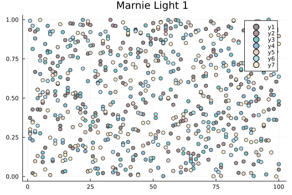
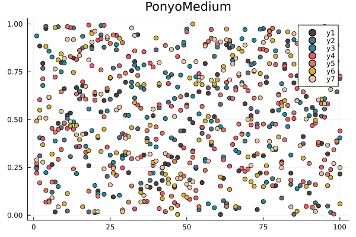

# GhibliPalettes.jl
Beautiful Ghibli colors

This is a full port of the great R package [ewenme/ghibli](https://github.com/ewenme/ghibli)

## How to use

```julia
using GhibliPalettes

# This will give you access to the ghibli dictionary in your global environment

ghibli["MononokeMedium"] # Check the nice oclors

# You are ready to go to use it in plots and cool stuff

using Plots

p = plot(title = "MarnieLight1", palette = ghibli["MarnieLight1"])
for c in eachcol(rand(100, 7))
    scatter!(p, c)
end
display(p)
```

